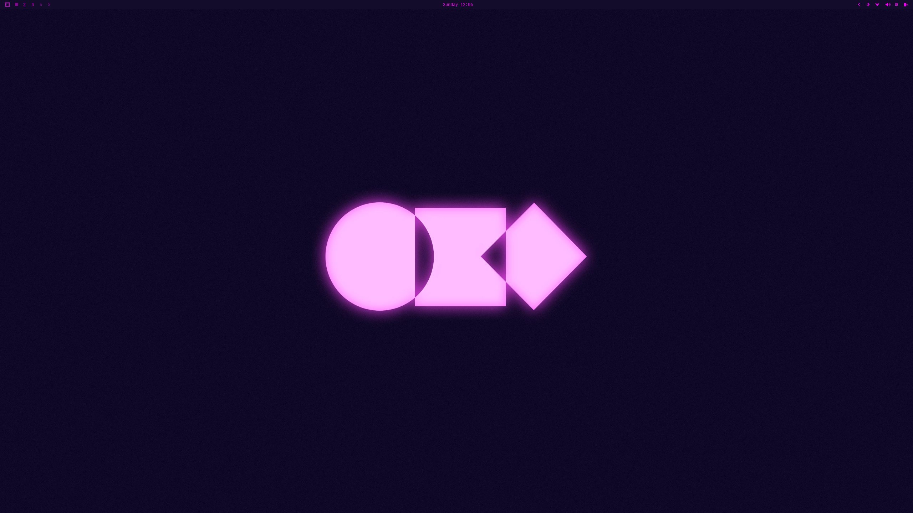

# Omacon Theme for Omarchy

> *"Making computers fun and cool again is vital."* — DHH, Omacon 2026



## The Story

On April 10, 2026, 130 builders, early-adopters, and Linux enthusiasts gathered at the Shopify SoHo Space in New York City for **Omacon**, the first ever Omarchy gathering. Speakers like DHH, Bjarne Øverli, ThePrimeagen, TJ DeVries, Vaxry (creator of Hyprland), and Dax Raad filled the room with energy, passion, and strong opinions about what Linux can and should be.

I wasn't there. But watching the stream, something clicked. The vibe, the aesthetic, the community, it all hit differently. And I fell in love with the colors of the Omacon logo: that deep cosmic violet bleeding into electric magenta. A glow that feels alive.

This theme is my tribute to that moment.

---


## Colors

The palette is built around the Omacon visual identity — dark purples, electric pinks, and soft lavender highlights that feel both aggressive and elegant.

| Role | Color | Hex |
|------|-------|-----|
| Background | Deep Cosmic | `#130c2b` |
| Foreground | Soft Lavender | `#f5caff` |
| Accent | Electric Pink | `#ff66ff` |
| Glow | Magenta Pulse | `#f200f3` |
| Selection | Pale Pink | `#ffbcff` |
| Border (inactive) | Dark Violet | `#651d6f` |

## Features

- **Window glow effect** — active windows emit a magenta/violet halo instead of a hard border
- **No borders** — clean edges, the glow does all the work
- **Blur** — subtle background blur with vibrancy boost
- **SwayOSD gradient** — volume bar pulses from pale pink to electric magenta
- **Full theme coverage** — Hyprland, Waybar, Kitty, Ghostty, Neovim, Zed, GTK, btop, Mako, Wofi, Walker, Hyprlock

## Installation

```bash
git clone https://github.com/Eidan78/omarchy-omacon-theme ~/.config/omarchy/themes/omacon
```

Then select **omacon** from the Omarchy theme menu (`Super + Ctrl + Shift + Space`).

This theme exists because that event reminded me why I love computers.

---

*Built with love for the Omarchy community using the amazing Aether as starting point.*
